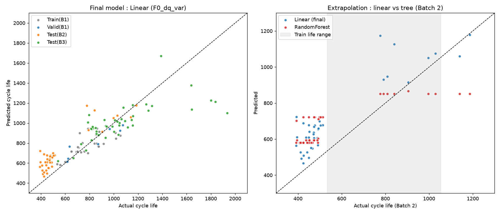
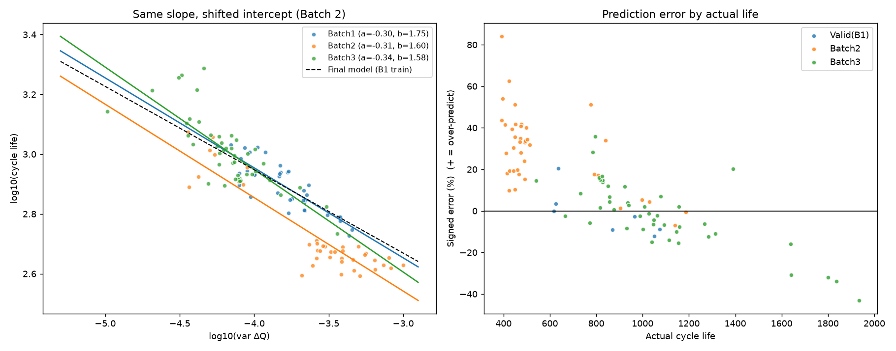

# ESS 배터리 수명 예측

ESS(BESS)에서 배터리 교체 비용은 설비투자(CAPEX)의 30~40%를 차지합니다.
이 프로젝트는 **운전 초기 100사이클 데이터만으로 리튬이온 셀의 수명(cycle life)을 예측**하여, 교체 시점을 사전에 계획하고 불량 셀을 조기에 선별하는 것을 목표로 합니다.

## 프로젝트 개요
- 데이터셋 : MIT-Stanford Battery Dataset (Severson et al., Nature Energy 2019)
- 학습 데이터 : Batch 1 (2017-05-12)
- 평가 데이터 : Batch 2 (2018-02-20) / 추가 검증 : Batch 3 (2018-04-12)
- 태스크 : **Regression** (Cycle Life 예측, 초기 100사이클 사용)
- Target : `log10(cycle_life)` → 예측 후 10^x로 복원하여 MAPE 계산
- DAY 1 모델 전략 보고서 : [`docs/DS-MINI-Design-울산_1반-배재연.pdf`](docs/DS-MINI-Design-울산_1반-배재연.pdf)

## 파일 구조
```
├── data/
│   └── README.md                 # 원본 .mat 다운로드·배치 방법 (용량 문제로 저장소에 미포함)
├── docs/
│   └── DS-MINI-Design-울산_1반-배재연.pdf   # DAY 1 EDA·모델 전략 보고서
├── notebooks/
│   └── 01_EDA.ipynb              # EDA (Q1~Q5, 배치 비교)
├── src/
│   ├── features.py               # .mat → 셀 단위 피처 표 (정제 + 피처 엔지니어링)
│   ├── train.py                  # 데이터 분할, 모델 탐색, 성능 리포트, 실험 1·2
│   └── error_analysis.py         # Batch 2 오류 원인 분석, 절편 보정 실험
├── results/
│   ├── features.csv              # 셀 139개 × 피처
│   ├── model_comparison.csv      # 피처 세트 3 × 모델 6 비교
│   ├── model_performance.csv     # 최종 모델 성능 (가이드 Format)
│   ├── predictions.csv           # 셀별 예측값·오차
│   ├── exp1_unreliable_cells.csv # 실험 1 결과
│   ├── error_analysis.csv        # 오류 분석 결과
│   └── figures/
├── requirements.txt
└── README.md
```

## 환경 설정
```bash
git clone https://github.com/nanaba26/ess-battery-project
cd ess-battery-project
pip install -r requirements.txt

# data/README.md 안내대로 .mat 파일을 data/ 에 넣은 뒤
python src/features.py        # 피처 표 생성 (약 5~10분)
python src/train.py           # 학습·평가·성능 리포트
python src/error_analysis.py  # 오류 분석
```

## EDA

> 상세 내용은 DAY 1 보고서(`docs/`) 참고

**데이터 품질 (전 분석 공통)**
- 결측치는 `isnull()` 기준 0개였지만, 모든 셀의 cycle 1 값이 0으로 기록된 **위장 결측치**가 있었습니다. 이 0값을 그대로 두면 가짜 상관이 생깁니다 (std_QD–IR 상관이 0.47이었다가, 0값을 지우면 0.02). → 0값과 이상치를 지운 뒤 피처를 계산했습니다.
- Batch 1 셀 10개(cell 0~4, 8, 10, 12, 13, 22)는 **EOL(용량 80%)에 도달하기 전에 기록이 종료**되었습니다. 이 셀들의 `cycle_life`는 실제 수명이 아니라 실험 종료 시점이므로 학습에서 제외했습니다 (→ 실험 1).

- **Cycle Life 분포**
	- Batch 1 : 534 ~ 1,227 (중앙값 858), 이상치 없음. 장수명(>1,000) 21.7%, 단수명(<500) 0%
	- 배치별 분포 차이가 큼 : Batch 2 중앙값 472 (**71.8%가 500 미만**), Batch 3 중앙값 1,006
	- 핵심 발견 : **테스트셋(Batch 2)의 대부분이 학습셋에 없는 수명 구간** → 학습 범위 밖 예측(외삽)이 가능한 모델이 필요

- **열화 곡선 분석**
	- 단명 셀은 400~600사이클, 장수 셀은 800~1,000사이클부터 급격히 하락
	- 모든 셀에서 Knee point(완만하다가 급락하는 지점)를 확인했고, 열화는 가속되는 비선형 형태
	- 핵심 발견 : 초기 100사이클의 용량(QD)은 셀 간 차이가 거의 없음 (수명과의 상관 r = 0.19) → **용량 값이 아닌 곡선 형태의 변화가 필요**

- **ΔQ(V) 곡선 분석**
	- ΔQ(V) = Q₁₀₀(V) − Q₁₀(V) : 100번째와 10번째 사이클의 방전 곡선 차이
	- 단명 셀일수록 ΔQ 곡선이 크게 휘고, 장수 셀은 0 근처에 위치
	- 핵심 발견 : **log10(var ΔQ)와 log10(수명)의 상관이 r = −0.85**이고, 세 배치 모두에서 강함 (−0.85 / −0.72 / −0.80)

- **충전 속도(C-rate)와 수명의 관계**
	- 1단계 C-rate가 높을수록 수명이 짧음 (ρ = −0.48, p = 0.001). 2단계 C-rate는 수명과 관계 없음 (p = 0.75)
	- 고속 충전 속도뿐 아니라 **고속으로 충전한 구간의 길이(%)**가 함께 영향 (8C(15%) 방식은 최고 속도지만 상위권)
	- 핵심 발견 : 충전시간·온도와 수명의 상관은 **배치마다 부호가 바뀜** (충전시간 +0.64 / −0.81 / +0.26) → Batch 1의 실험 설계에 종속된 신호

## Modeling

### 피처 엔지니어링 전략
| 피처 세트 | 구성 | 근거 (EDA) |
|---|---|---|
| **F0** | `log_dq_var` | 전 배치에서 안정적인 단일 핵심 신호 (원논문 variance model과 같은 구성) |
| FA | F0 + `log_dq_min`, `dq_mean`, `qd_cycle2`, `qd_max_minus_c2`, `qd_slope_91_100` | ΔQ 곡선의 다른 요약 + Knee 이전의 미세한 용량 변화 |
| FB | FA + `med_chargetime_2_6`, `mean_Tavg`, `C1` | Batch 1 안에서 상관이 있던 충전 조건·발열 |

- 모든 피처는 0값과 이상치를 지운 뒤 계산했습니다.
- 결측 대체와 스케일링은 Pipeline 안에서 train 데이터로만 fit했습니다 (데이터 누수 방지).

### 데이터 분할
| 구분 | 구성 | 근거 |
|---|---|---|
| Train | Batch 1 신뢰 셀 36개 중 29개, **GroupKFold(5) CV** | 그룹 = 충전 방식 |
| Valid | Batch 1 Hold-out 7개 (충전 방식 4종 단위로 분리) | 같은 방식의 셀이 train과 valid로 갈라지면 누수가 생김 (코드에서 assert로 검증) |
| Test | Batch 2 39개 (수명 미기록 8개 제외) | 모델 확정 후 1회 평가 |

### 모델 선택 및 근거
- 후보 모델 : Linear, Ridge, Lasso, ElasticNet (1순위 : 외삽 가능, 소표본에서 정규화) / RandomForest, GradientBoosting (2순위 : 비선형 비교용)
- 하이퍼파라미터 : 후보별로 Train CV MAPE가 가장 낮은 값을 선택 (Grid)
- 최종 모델 : 피처 세트 × 모델 18개 조합 중 **Valid MAPE가 가장 낮은 `Linear Regression + F0(log_dq_var)`** 를 선택

| 피처 세트 + 모델 | Train CV | Valid |
|---|---|---|
| **F0 + Linear (최종)** | 9.16 | **8.09** |
| F0 + Ridge | 9.13 | 8.52 |
| F0 + RandomForest | 9.45 | 13.01 |
| FA + Lasso | 5.44 | 15.61 |
| FA + Linear | **3.95** | 20.42 |

- 선택 이유 : FA + Linear는 Train 오차가 3.95%로 가장 낮지만 Valid 오차는 20.42%입니다. 학습 셀 29개에 피처 6개를 쓰면서 **과적합**이 일어났습니다. 반면 ΔQ 단일 피처 모델은 Train과 Valid 오차가 비슷해 가장 잘 일반화되었습니다.

## 성능 결과

**최종 모델 : Linear Regression + log10(var ΔQ)**

| 구분 | MAPE (%) | 비고 |
|---|---|---|
| Train (Batch 1 CV) | 9.16 | |
| Valid (Batch 1 Hold-out) | 8.09 | |
| Test (Batch 2) | **29.62** | |
| Gap (Train-Valid) | −1.07 | (+) : 과적합 의심 → 과적합 없음 |
| Gap (Valid-Test) | +21.53 | (+) : 배치간 일반화 저하 의심 → **Batch 2 오프셋** (오류 분석) |
| Gap (Target-Test) | +20.52 | Target : 원논문 9.1% |
| Test (Batch 3) | 12.16 | 추가 검증 |
| Gap (Batch2-Batch3) | −17.46 | Test 성능 간 비교 |
| Gap (Target-Test, Batch 3) | +3.06 | Batch 3 기준, 원논문 성능 비교 |

**Gap 해석**
- **Train-Valid (−1.07)** : Valid 오차가 Train보다 오히려 낮습니다. 단일 피처 선형 모델이라 과적합이 없습니다.
- **Valid-Test (+21.53)** : Batch 1 안에서는 8%대로 예측하지만 Batch 2에서는 29.6%로 크게 나빠집니다. 원인은 모델 구조가 아니라 **Batch 2 전체가 같은 ΔQ에서 수명이 약 21% 짧은 배치 단위의 차이**입니다 (오류 분석 참고).
- **Target-Test (+20.52)** : 원논문 목표 9.1% 대비 큰 차이가 있습니다. 다만 원논문은 여러 배치의 셀을 섞어서 학습·테스트를 구성한 것으로 알려져 있어, Batch 1만으로 학습해 다른 배치를 맞히는 본 과제가 더 어려운 조건입니다. 배치 오프셋이 작은 Batch 3에서는 12.16%로 목표와의 차이가 3.06%p입니다.

**추가 실험**

| 실험 | 결과 | 결론 |
|---|---|---|
| 실험 1 : EOL 미도달 셀 10개 포함 | Valid 8.09% → 12.52%, Test(B2) 29.62% → 37.46% | 잘못된 수명 라벨 제거가 성능에 중요 |
| 실험 2 : 같은 피처로 RandomForest | Batch 2 예측 최솟값 580 (실제 392, 학습 최솟값 534) | 트리 모델은 학습 범위 밖을 예측하지 못함 → 선형 모델 선택 근거 확인 |



## 오류 분석


- **모델이 가장 크게 틀린 셀의 공통점**
	- Batch 2 셀의 94.9%를 **수명보다 길게 예측**했습니다 (평균 +29.2%). Batch 3는 −1.3%로 편향이 거의 없습니다.
	- 오차 상위 셀은 모두 Batch 2의 **단수명 셀(393~449사이클)**입니다. 실제 수명과 오차의 상관은 ρ = −0.48로, 수명이 짧을수록 더 크게 틀립니다.
	- 반대로 Batch 3의 초장수명 셀(1,600~1,935)은 짧게 예측했습니다. 학습 범위(최대 1,054)를 넘는 구간이라 생긴 외삽 오차입니다.
- **원인 가설**
	- 배치별 직선 `log(수명) = a·log(var ΔQ) + b`를 비교하면 **기울기는 같고(−0.30 / −0.31) 절편만 낮습니다(1.75 → 1.60)**. "ΔQ가 클수록 빨리 열화된다"는 규칙은 Batch 2에서도 유지되고, 배치 전체가 일정 비율만큼 짧게 사는 것입니다.
	- 충전 방식이 같은 `4.8C(80%)-4.8C` 셀은 Batch 1과 Batch 2의 ΔQ가 똑같이 −3.80인데, 수명은 753에서 629로 짧습니다. → 원인은 충전 방식이 아니라 **배치 자체**입니다.
	- 오차는 충전 조건(C1, C2)이나 온도와 상관이 없습니다 (p > 0.2). → 데이터에 기록되지 않은 **배치 단위 요인**(셀 제조 로트, 보관 기간, 실험 장비 등)으로 추정합니다.
- **개선 방향**
	- **절편 보정 (사후 실험)** : Batch 2 셀 5개로 절편만 다시 맞추면 나머지 셀의 MAPE가 **29.62%에서 12.43%(±1.72)**로 낮아집니다. 오차 대부분이 배치 오프셋 하나로 설명됩니다.
	- 학습 데이터에 여러 배치를 포함하고, 배치 정보를 반영하는 피처(보관 기간, 셀 로트)를 추가합니다.
	- ※ 절편 보정은 Test 데이터 일부를 쓴 사후 분석이므로 공식 성능(29.62%)에는 반영하지 않았습니다.

## ESS 도메인 해석
- **이 모델을 실제 BESS에 적용한다면 어떤 의사결정에 활용 가능한가?**
	- **조기 수명 예측** : ESS가 하루 1사이클로 운전된다고 가정하면, 100사이클은 운전 약 3개월에 해당합니다. 수년이 걸리는 수명을 3개월 만에 예측하여 **교체 예산과 시점을 미리 계획**할 수 있습니다.
	- **입고 셀 선별** : ΔQ 분산이 큰 셀(단명 위험)을 초기에 골라내 랙·모듈 구성에서 제외하면, 약한 셀 하나가 전체 랙의 성능을 끌어내리는 문제를 줄일 수 있습니다.
	- **로트 단위 보정 절차** : 새 로트가 들어오면 기준 셀 3~5개를 수명 끝까지 시험해 모델의 절편을 보정하고, 나머지 셀은 초기 100사이클로 예측합니다 (오류 분석의 절편 보정 실험 근거).
- **어떤 한계가 있으며, 실 배포를 위해 추가로 필요한 것은 무엇인가?**
	- **배치 간 이동** : 학습하지 않은 배치에서 오차가 크게 늘었습니다 (Batch 2 29.6%). 실제 운영에서는 로트마다 보정하고, 입력 데이터 분포의 변화(Data Drift)를 모니터링해야 합니다.
	- **실험실과 현장의 차이** : 이 데이터는 일정 온도에서 고속 충전과 완전 방전을 반복한 실험입니다. 실제 ESS는 부분 충방전, 대기 시간, 계절별 온도 변화가 있어 현장 데이터로 재검증이 필요합니다.
	- **표본 수** : 학습 셀 29개, 충전 방식당 1~3개로 적습니다. 여러 배치를 모아 데이터를 늘려야 합니다.
	- **ΔQ 측정 조건** : ΔQ(V)는 일정한 방전 조건에서 측정한 곡선이 필요합니다. 현장에서는 주기적인 진단용 표준 방전 사이클을 운영 절차에 넣어야 합니다.
	- **재학습 기준** : 새 로트나 운전 조건이 바뀌면 재보정하거나 재학습하는 조건을 미리 정의해야 합니다.

## 참고문헌
- Severson et al. (2019). Data-driven prediction of battery cycle life before capacity degradation. *Nature Energy*, 4, 383–391.

## 팀 구성
- 배재연 (울산 캠퍼스 1반) : EDA, 피처 엔지니어링, 모델 개발, 성능 평가(Batch 2·3), 오류 분석
